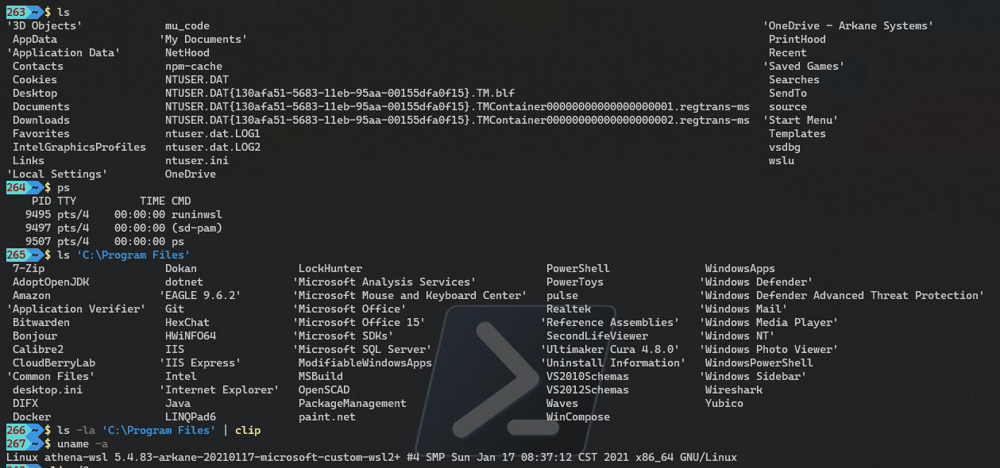

# RunInGenie
Quickly run a WSL/Linux command from a Windows (e.g., PowerShell or CMD) prompt.

[](https://ko-fi.com/I3I1VA18)

## Introduction
This is essentially a variant of [RunInBash](https://github.com/neosmart/RunInBash) designed to run Linux commands under WSL inside the bottle created by _genie_ (see https://github.com/arkane-systems/genie) if you aren't familiar with genie, which permits the use of _systemd_ and its services under WSL.

RunInGenie runs the supplied command using _genie -c_, feeding back stdout and stderr, and passing the return code back to the caller, for your convenience in building hybrid Windows/Linux scripts.

Simply prefix the Linux command with the dollar sign ($):

```
$ uname -a
```

and there you go!

```
Linux athena-wsl 5.4.83-arkane-20210117-microsoft-custom-wsl2+ #4 SMP Sun Jan 17 08:37:12 CST 2021 x86_64 GNU/Linux
```

Note that by default pipes (|), etc., will be interpreted by PowerShell, so:

```
$ ls -la 'C:\Program Files' | clip
```

Will send the directory listing to the _Windows_ clip.exe. If you wish to pipe within WSL, you must escape it with a backtick (`), thus:

```
$ ls -la 'C:\Program Files' `| less
```

### Shell

Using RunInGenie without specifying a command:

```
$
```

Opens a shell in the current directory, useful for entering multiple commands in sequence without returning to Windows.

Please note that this _is not_ a login shell, and as such, for example, does not execute your login profile; `$` should not be used as a substitute for `wsl genie -s` to start a dedicated WSL shell. It's intended as a convenience for "I need a quick shell here" situations.

### Distro selection

Normally, RunInGenie executes Linux commands in the default WSL distribution (but see _Configuration_, below). This can be overriden by using the -d/--distro option, which must be the first thing specified after the `$`, and takes the distro name as shown by `wsl -l`, thus:

```
$ -d alpine cat /etc/os-release
NAME="Alpine Linux"
ID=alpine
VERSION_ID=3.11.3
PRETTY_NAME="Alpine Linux v3.11"
HOME_URL="https://alpinelinux.org/"
BUG_REPORT_URL="https://bugs.alpinelinux.org/"
```

Obviously, any distribution chosen by -d/--distro must have genie installed, or the command will fail.

## Examples



## Installation

Grab the latest RunInGenie.zip from the Releases page, unzip it, and put the resulting $.exe somewhere on your PATH. Easy!

This assumes, of course, that you already have genie installed and running correctly. If not, it won't work. genie 1.32 or higher is recommended, as earlier versions of genie had issues with arguments containing spaces. If `$ ls -la 'C:\Program Files\'` produces an error complaining that _ls_ can't find _/mnt/c/Program_, you need to upgrade your genie installation.

## Configuration

By default, RunInGenie uses the `sh` shell to execute commands (or to start when executed without parameters), and executes those commands in the WSL default distribution. These can be overridden by creating the JSON file `$.json` in the same directory as the `$.exe` executable, in the following format:

```
{
  "shell":  "zsh",
  "distro": "debian"
}
```

Either or both options can be specified to change the defaults.

## Bugs

Yes, there almost certainly are. Quoting is complicated.

Reports of commands which break when used with RunInGenie are welcome. Patches and pull requests are even more welcome.
